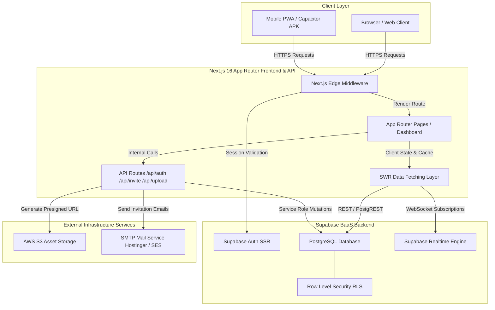
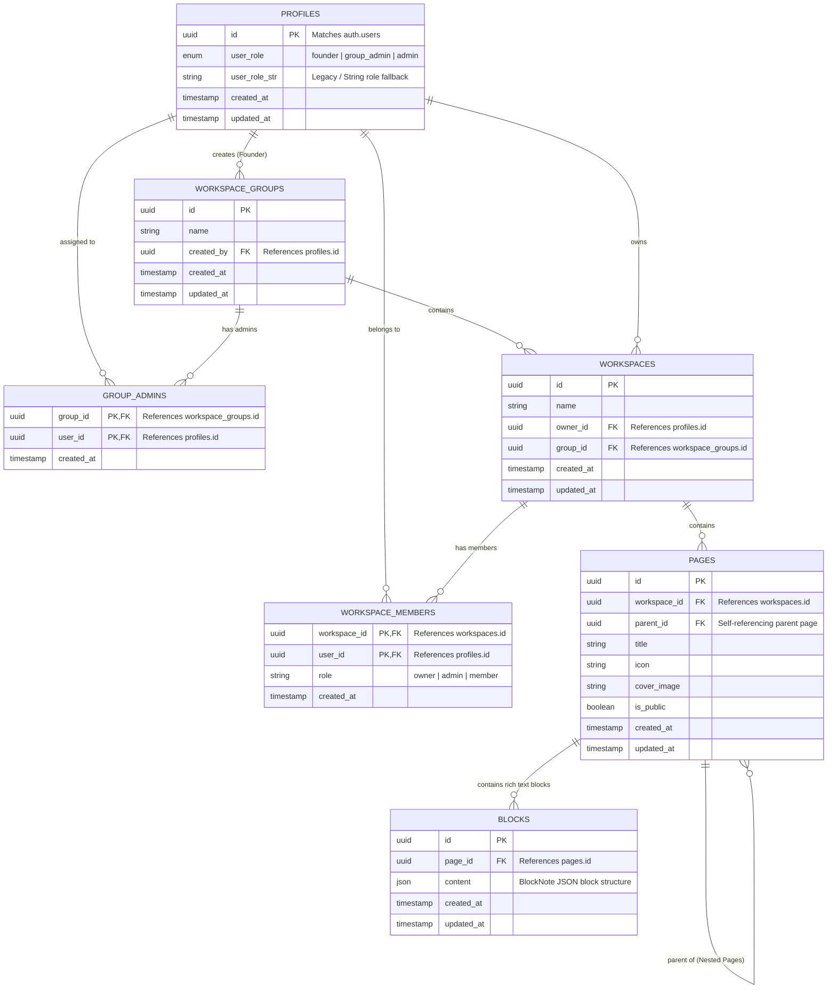
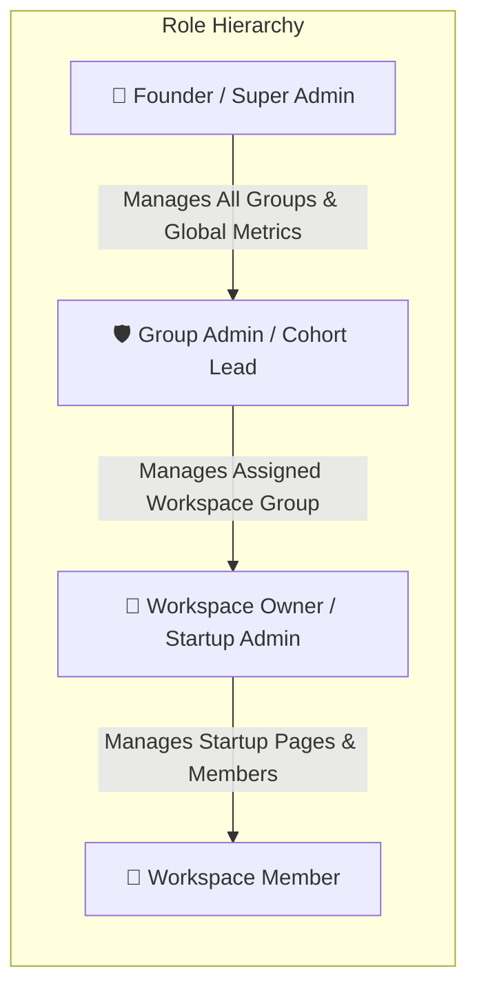
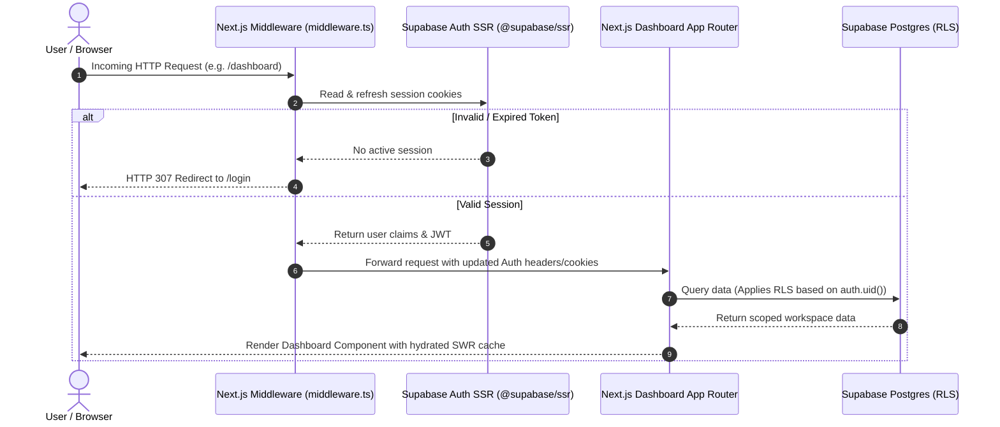
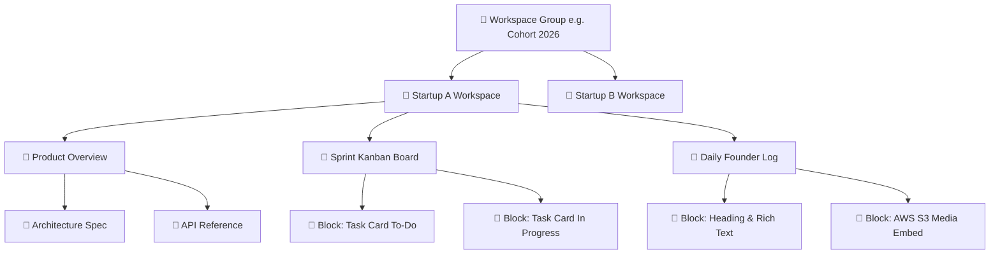
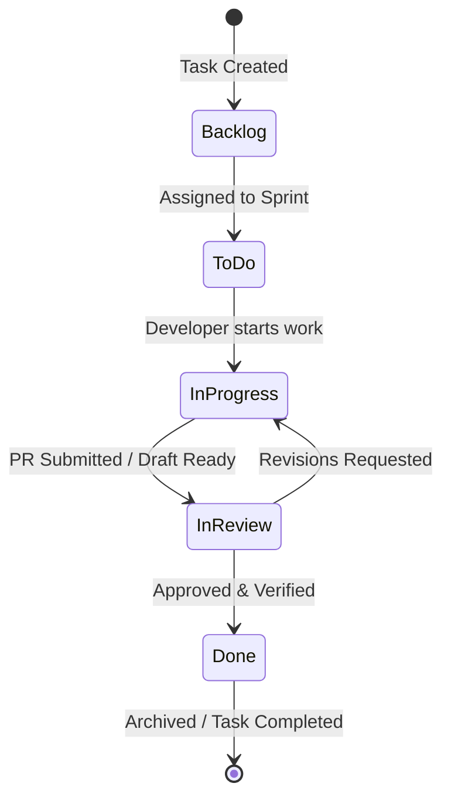
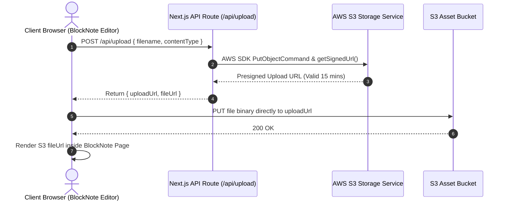
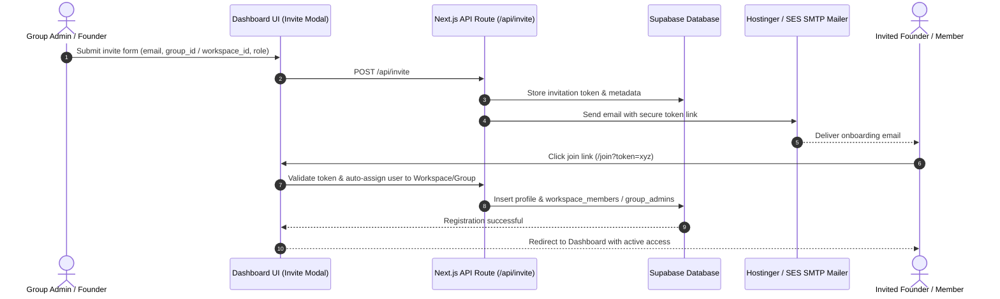

# 🚀 ThinkSoul LMS — Startup Incubation & Learning Management System

> **A real-time, scalable, Notion-like Learning & Incubation Management Platform designed to track, mentor, and incubate 300–400+ startup projects simultaneously.**

[](https://thinksoul-lms-demo.netlify.app)

---

## 📌 Executive Summary

**ThinkSoul LMS** is a modern, high-performance web platform built to solve the operational bottlenecks of startup incubators, accelerators, and educational hubs. 

Instead of juggling static spreadsheets, dis-jointed chat apps, and bulky enterprise LMS platforms, ThinkSoul provides a single **Notion-like collaborative workspace** coupled with **bird's-eye management dashboards**, real-time task tracking, interactive analytics, and multi-tenant security.

---

## ✨ Key Features & Capabilities

- 📄 **Notion-Like Block Editor**: Block-based rich-text editor powered by `@blocknote/react` and `@blocknote/mantine` for creating daily logs, execution docs, pitch decks, and knowledge bases with nested pages, icons, and cover images.
- 📊 **Kanban Task Management**: Drag-and-drop task boards using `@hello-pangea/dnd` for smooth sprint management, status tracking (To-Do, In Progress, Review, Done), assignees, and priority tags.
- 📅 **Integrated Calendar View**: Visual scheduling for incubator check-ins, demo days, sprint deadlines, and daily founder logs.
- 📈 **Custom Chart Builder**: Interactive analytics powered by `recharts` for monitoring cohort velocity, task completion rates, and startup milestone progress.
- 🏢 **Multi-Tenant Workspace Groups**: Hierarchical organization supporting global founders, incubator group admins, and individual startup workspace members.
- 🔒 **Row-Level Security (RLS) & Auth**: Supabase Auth SSR middleware integration (`@supabase/ssr`) with PKCE auth flow, cookie-based session management, and granular database RLS policies.
- 🖼️ **AWS S3 Presigned Uploads**: Direct-to-S3 client media uploads using `@aws-sdk/s3-request-presigner` for seamless high-resolution image and video embedding.
- 📧 **Automated Email Onboarding**: Nodemailer SMTP integration for inviting Group Admins and workspace members with cryptographically secure single-use invitation tokens.
- ⚡ **Realtime Caching & Updates**: Data fetching powered by `swr` and Supabase Realtime WebSocket subscriptions for instantaneous UI updates across workspaces.

---

## 🏗️ System Architecture



---

## 🗄️ Database Schema & Entity Relationships (ERD)



---

## 👥 User Roles & Permissions Matrix (RBAC)



| Feature / Action | 👑 Founder | 🛡️ Group Admin | 🏢 Workspace Owner | 👤 Member |
| :--- | :---: | :---: | :---: | :---: |
| **Global Admin Dashboard View** | ✅ | ❌ | ❌ | ❌ |
| **Create / Manage Workspace Groups** | ✅ | ❌ | ❌ | ❌ |
| **Assign Group Admins** | ✅ | ❌ | ❌ | ❌ |
| **Manage Group Workspaces** | ✅ | ✅ | ❌ | ❌ |
| **Invite Group Members** | ✅ | ✅ | ✅ | ❌ |
| **Create / Edit Notion Pages & Blocks** | ✅ | ✅ | ✅ | ✅ |
| **Drag & Drop Kanban Tasks** | ✅ | ✅ | ✅ | ✅ |
| **Build & Customize Analytics Charts** | ✅ | ✅ | ✅ | ❌ |

---

## 🔐 Authentication & Session Security Flow



---

## 📑 Notion-Like Workspace & Content Hierarchy



---

## 📋 Kanban & Task Management Workflow



---

## 🖼️ Media Upload & AWS S3 Presigned URL Flow



---

## 📧 Member Invitation & Onboarding Workflow



---

## 🚀 CI/CD & Production Deployment Pipeline

```mermaid
graph LR
    subgraph Development
        Dev[💻 Developer] -->|git push origin main| GitHub[🐙 GitHub Repository]
    end

    subgraph GitHub Actions Runner
        GitHub -->|Triggers Workflow| Workflow[.github/workflows/deploy.yml]
        Workflow -->|1. Checkout & Setup Node 20| BuildStep[npm run build]
        BuildStep -->|2. Next.js Standalone Bundle| ZipStep[Package deploy.zip]
    end

    subgraph Production VPS Server
        ZipStep -->|3. SCP Transfer| Transfer[Secure Copy to VPS]
        Transfer -->|4. SSH Commands| DeployStep[Unzip & Inject Production .env]
        DeployStep -->|5. PM2 Process Manager| PM2[pm2 restart thinksoul]
        PM2 -->|Serves Traffic| Web[🌐 Production Web App https://thinksoul.in]
    end
```



---

## 🛠️ Technology Stack Breakdown

| Layer | Technology | Description |
| :--- | :--- | :--- |
| **Core Framework** | Next.js 16 (App Router) | Server & Client components, Edge middleware, Server Actions, API routes |
| **UI Library & React** | React 19, TypeScript | Strict typed components and client hooks |
| **Styling & CSS** | Tailwind CSS v4, PostCSS | Modern responsive styling engine |
| **Rich Text Editor** | `@blocknote/react` `@blocknote/mantine` | Notion-style block editor with customizable block structures |
| **Drag & Drop** | `@hello-pangea/dnd` | Accessible fluid drag-and-drop for Kanban boards |
| **Charts & Analytics** | `recharts` | Composable charting library for progress tracking |
| **Database & Auth** | Supabase (PostgreSQL, Auth SSR, RLS) | Relational database, JWT Auth, RLS policies, Realtime Engine |
| **Object Storage** | AWS S3 SDK (`@aws-sdk/client-s3`) | Presigned URL direct client uploads for media assets |
| **Email Service** | Nodemailer | Transactional email delivery for invitations and password resets |
| **Icons** | Lucide React | Clean, scalable UI icon system |
| **Process Manager** | PM2 | Daemon process management for production VPS deployment |

---

## 📂 Project Directory Structure

```files
thinksoul-lms/
├── .github/
│   └── workflows/
│       └── deploy.yml              # Automated GitHub Actions CI/CD workflow
├── docs/
│   ├── LMS_Project_Proposal.md     # Platform architecture proposal
│   ├── clarity.md                  # Comprehensive requirements & spec
│   └── implementation_Plan.md      # Feature roadmap & technical milestones
├── public/                         # Static icons, favicons, and images
├── src/
│   ├── app/                        # Next.js App Router Pages & API Endpoints
│   │   ├── api/
│   │   │   ├── auth/              # Auth callbacks & session management
│   │   │   ├── invite/            # Group & workspace invitation handling
│   │   │   ├── register/          # New user registration endpoints
│   │   │   └── upload/            # AWS S3 Presigned upload URL generation
│   │   ├── dashboard/             # Core multi-workspace dashboard UI
│   │   ├── join/                  # Onboarding & invite token acceptance page
│   │   ├── login/                 # User authentication page
│   │   ├── register/              # Founder registration page
│   │   ├── reset-password/        # Password reset flow
│   │   ├── globals.css            # Tailwind & global stylesheet rules
│   │   └── layout.tsx             # Main application layout wrapper
│   ├── components/
│   │   ├── admin/                 # Founder Master Admin views
│   │   ├── board/                 # Kanban board, Calendar, and Charts components
│   │   ├── editor/                # BlockNote Notion-like block editor component
│   │   ├── landing/               # Marketing & landing page UI
│   │   ├── layout/                # Dashboard Shell, Topbar, Sidebar, Spaces views
│   │   └── modals/                # Task, Group, Workspace, Profile, Settings modals
│   ├── types/
│   │   └── supabase.ts            # Auto-generated Supabase database TypeScript types
│   ├── utils/
│   │   ├── mail.ts                # Nodemailer email utility functions
│   │   ├── s3/                    # AWS S3 client setup & presigned URL helpers
│   │   └── supabase/              # Supabase server/client auth middleware helpers
│   └── proxy.ts                   # Custom proxy handling
├── supabase/
│   ├── config.toml                # Supabase local environment configuration
│   └── migrations/                # Versioned SQL migration files & RLS policies
├── .env.example                   # Environment variable template
├── next.config.ts                 # Next.js framework configuration
├── package.json                   # Project dependencies and npm scripts
├── postcss.config.mjs             # PostCSS plugin settings
├── tsconfig.json                  # TypeScript compiler settings
└── README.md                      # Detailed project documentation
```

---

## ⚡ Getting Started & Local Development

### 1. Prerequisites

- **Node.js**: v20.x or higher
- **npm**: v10.x or higher
- **Supabase Account / Local CLI**: For database & authentication
- **AWS S3 Bucket**: For media uploads (optional for basic local dev)

### 2. Installation

Clone the repository and install dependencies:

```bash
git clone https://github.com/Omkar-Hundre/thinksoul.git
cd thinksoul
npm install
```

### 3. Environment Configuration

Copy the sample environment file and configure your credentials:

```bash
cp .env.example .env.local
```

Edit `.env.local`:

```env
NEXT_PUBLIC_SUPABASE_URL=https://your-supabase-project.supabase.co
NEXT_PUBLIC_SUPABASE_ANON_KEY=your-supabase-anon-key
SUPABASE_SERVICE_ROLE_KEY=your-supabase-service-role-key

AWS_REGION=eu-north-1
AWS_BUCKET_NAME=your-s3-bucket-name
AWS_ACCESS_KEY_ID=your-aws-access-key-id
AWS_SECRET_ACCESS_KEY=your-aws-secret-access-key

SMTP_HOST=smtp.hostinger.com
SMTP_PORT=465
SMTP_FROM_EMAIL=contact@yourdomain.com
SMTP_USER=contact@yourdomain.com
SMTP_PASS=your-smtp-password

NEXT_PUBLIC_APP_URL=http://localhost:3000
```

### 4. Database Setup

Apply Supabase SQL migrations to your database:

```bash
npx supabase db push
# Or run migrations located in supabase/migrations/ directly via Supabase SQL Editor
```

### 5. Running Development Server

Start the Next.js development server:

```bash
npm run dev
```

Open `http://localhost:3000` in your browser to access ThinkSoul LMS.

---

## 📜 Available NPM Scripts

- `npm run dev`: Starts local development server on port 3000 with hot reloading.
- `npm run build`: Compiles production build with TypeScript check & Next.js static optimizations.
- `npm run start`: Runs production server using compiled `.next` build.
- `npm run lint`: Runs ESLint check across all codebase files.

---

## 🌐 Production VPS Deployment

ThinkSoul LMS includes an automated GitHub Actions deployment workflow (`.github/workflows/deploy.yml`).

### Steps for Deployment:

1. Configure GitHub Repository Secrets:
   - `NEXT_PUBLIC_APP_URL`
   - `NEXT_PUBLIC_SUPABASE_URL`
   - `NEXT_PUBLIC_SUPABASE_ANON_KEY`
   - `SUPABASE_SERVICE_ROLE_KEY`
   - `AWS_REGION`, `AWS_BUCKET_NAME`, `AWS_ACCESS_KEY_ID`, `AWS_SECRET_ACCESS_KEY`
   - `SMTP_HOST`, `SMTP_PORT`, `SMTP_FROM_EMAIL`, `SMTP_USER`, `SMTP_PASS`
   - `SERVER_IP`, `SSH_PRIVATE_KEY`

2. Push changes to `main` branch:
   ```bash
   git add .
   git commit -m "feat: updates and documentation"
   git push origin main
   ```

3. The GitHub Action automatically builds the standalone Next.js package, transfers it via SCP to your VPS, writes `.env`, and restarts the app using **PM2**.

---

## 🛡️ Security & Row-Level Security (RLS)

All tables in ThinkSoul LMS enforce strict **PostgreSQL Row-Level Security (RLS)**:
- Users can only read/write workspaces and pages where they hold valid membership (`workspace_members`) or group administration rights (`group_admins`).
- Founders bypass group boundaries via global `user_role = 'founder'`.
- All media uploads are signed server-side using AWS SDK S3 Presigned URLs, preventing unauthorized bucket writes.

---

## 🤝 License & Support

Developed with ❤️ for the startup incubation ecosystem. 

For inquiries, support, or custom deployment requests, contact: **[contact@thinksoul.in](mailto:contact@thinksoul.in)**.
